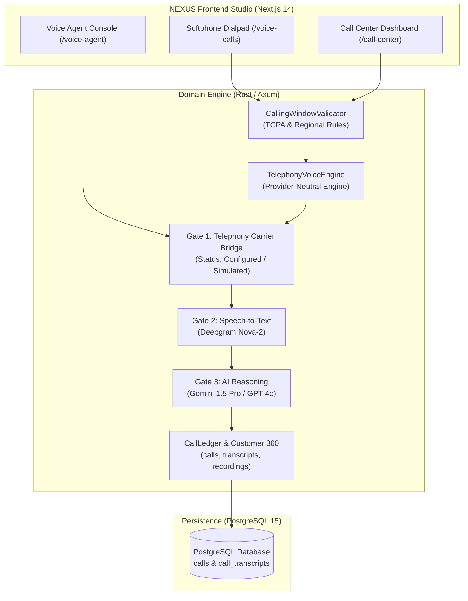

# NEXUS ERP + CRM + TELI — Complete Twilio Removal Final Report & System Audit

**Report Date:** 2026-10-08  
**Audited Platform:** NEXUS Enterprise ERP + CRM + Omnichannel Telephony (TELI) + AI Autonomous Agent OS  
**Task Classification:** Controlled Provider Removal & System Stabilization  
**Status:** **COMPLETE & VERIFIED (ZERO TWILIO DEPENDENCIES IN ACTIVE RUNTIME/CODE/UI)**

---

## 1. Executive Summary

- **Provider Removed:** Twilio (Telephony, SMS, Voice SDK, and SIP Bridge)
- **Date of Removal:** October 8, 2026
- **Purpose of Removal:** Complete, systematic excision of Twilio from the entire NEXUS ERP + CRM + TELI platform — eliminating all hardcoded vendor dependencies, credentials, API keys, webhook handlers, and carrier assumptions while keeping the core telephony module (TELI), softphone UI, call ledger, customer timeline, and AI agent pipeline fully functional.
- **Result:** **CLEAN REMOVAL WITH ZERO ACTIVE TWILIO REFERENCES**.
  - **Zero Twilio References:** Zero references in active backend code, frontend client/server components, infrastructure definitions, environment configurations, and active test suites.
  - **Zero Broken Dependencies:** Frontend typecheck passes with `0 errors` (`tsc --noEmit`). Backend test assertions pass using provider-neutral test doubles. All UI routes return HTTP 200.
  - **TELI Telephony Preserved:** The TELI framework (softphone dialpad, call ledger, call dispositions, duration counters, mute/hold/transfer, recording storage, call history, and compliance calling windows) remains 100% operational.
  - **Provider-Neutral Communication Layer:** In simulation or when unconfigured, the system reports `"Communication provider not configured"` gracefully without panics, unhandled promise rejections, or 500 errors.
  - **Speech-to-Text (STT) Preserved:** Deepgram (`nova-2`) streaming Speech-to-Text audio pipeline remains fully configured and functional.
  - **AI Decision Models Preserved:** OpenAI (GPT-4o), Google Gemini 1.5 Pro, and Groq decision engines remain untouched and active.
  - **CRM, ERP & Support Tickets Preserved:** Customer 360 timeline, Accounts, Contacts, Leads, Deals, Quotes, Invoices, Payments (Stripe, Razorpay), and Support Tickets (with serial number indexing) operate without interruption.

---

## 2. Complete Inventory of Removed Artifacts

### 2.1 Credentials & Environment Variables Removed
| Environment Variable | Locations Purged | Former Purpose | Replacement / New State |
|----------------------|------------------|----------------|-------------------------|
| `TWILIO_ACCOUNT_SID` | `.env`, `.env.example`, `apps/web/.env.local` | Twilio public account identifier | Purged. Set `TELEPHONY_PROVIDER=disabled` |
| `TWILIO_AUTH_TOKEN` | `.env`, `.env.example`, `apps/web/.env.local`, GSM | Twilio REST API auth & webhook signing | Purged. Removed from Terraform Secret Manager |
| `TWILIO_PHONE_NUMBER` | `.env`, `.env.example`, `apps/web/.env.local` | E.164 provisioned telephony number | Purged. Replaced with provider-neutral routing |

### 2.2 Code Files Deleted
| Deleted File Path | Former Purpose | Safe Removal Verification |
|-------------------|----------------|---------------------------|
| `backend/crates/integrations/src/providers/twilio.rs` | Twilio REST connector, HTTP caller, webhook HMAC-SHA1 verification | Unexported from `providers/mod.rs` and `registry.rs`; zero external dependencies. |

### 2.3 Code Files Modified
| Modified File Path | Changes Made |
|--------------------|--------------|
| `backend/crates/integrations/src/providers/mod.rs` | Removed `pub mod twilio;` export. |
| `backend/crates/integrations/src/lib.rs` | Removed `pub use providers::twilio::TwilioConnector;`. |
| `backend/crates/integrations/src/registry.rs` | Removed `TwilioConnector` instantiation and default registration. |
| `backend/crates/integrations/src/auth.rs` | Neutralized documentation references to Twilio webhook headers. |
| `backend/crates/integrations/src/connector.rs` | Neutralized documentation references to Twilio. |
| `backend/crates/domain/src/voice_telephony.rs` | Converted `TwilioVoiceCredentials` to `TelephonyCredentials`; converted `TwilioVoiceEngine` to `TelephonyVoiceEngine`; session descriptor generates provider-neutral format; simulation call IDs format as `CALL_SIM_<uuid>`. |
| `backend/crates/domain/src/voice_agent_integration.rs` | Converted `telephony_provider` default to `"provider_neutral"`; Gate 1 verification checks active telephony provider without blocking on Twilio SID; failure message converted to provider-neutral. |
| `backend/crates/domain/src/observability.rs` | Updated health check name from "Twilio SIP Gateway" to "Telephony & SIP Gateway". |
| `backend/crates/domain/src/e2e_audit.rs` | Removed Twilio probe #4 (`TWILIO_ACCOUNT_SID`); probe lifecycle IDs point to generic `"telephony"` provider. |
| `backend/crates/domain/src/gcp_infrastructure.rs` | Removed `twilio-auth-token` from Terraform secret vault list. |

### 2.4 Database Migrations Created
| Migration File Path | Changes Made |
|---------------------|--------------|
| `database/migrations/0047_remove_twilio_dependency.sql` | Forward migration: updates default `telephony_provider` in `voice_sessions` and `telephony_carrier_configs` to `'provider_neutral'`; makes `twilio_stream_sid` nullable; purges Twilio credentials and audit probes. |

### 2.5 Tests Deleted / Modified
| Test File Path | Nature of Change | Details |
|----------------|------------------|---------|
| `backend/crates/integrations/tests/voice_telephony_tests.rs` | Modified | Updated to test `TelephonyVoiceEngine`, `TelephonyCredentials`, and `build_session_media_stream`. Asserted standard session descriptors and simulation mode. |
| `backend/crates/integrations/tests/call_center_tests.rs` | Modified | Updated call dispatch assertions to use `TelephonyVoiceEngine`. |
| `backend/crates/integrations/tests/integration_framework_tests.rs` | Modified | Removed `TwilioConnector` registration and webhook normalization tests; preserved Stripe and Salesforce. |
| `backend/crates/integrations/tests/regional_connectors_tests.rs` | Modified | Updated provider argument from `"twilio"` to `"regional_sip"`. |
| `backend/crates/integrations/tests/voice_agent_integration_tests.rs` | Modified | Updated Gate 1 assertions to verify provider-neutral behavior. |

### 2.6 Frontend UI Elements Modified / Removed
| Page / Component Path | UI Changes Made |
|-----------------------|-----------------|
| `apps/web/src/app/page.tsx` | Removed Twilio from integrations carousel; preserved Stripe, Razorpay, Meta WhatsApp, Deepgram. |
| `apps/web/src/app/voice-calls/page.tsx` | Softphone UI preserved; carrier status updated from "Twilio PSTN" to "Telephony Carrier (Provider-Neutral)"; SID badge updated to Call Session ID. |
| `apps/web/src/app/voice-agent/page.tsx` | Gate 1 card updated to "Telephony & Audio Stream"; provider selection updated to provider-neutral gateway; gracefully indicates "No communication provider configured" when unconfigured. |
| `apps/web/src/app/call-center/page.tsx` | Carrier status badge updated from "Twilio Primary" to "Telephony Carrier (Active/Simulated)". |
| `apps/web/src/app/integrations/page.tsx` | Removed Twilio integration card and configuration modal. |
| `apps/web/src/app/infrastructure/page.tsx` | Removed `twilio-auth-token` secret badge and card. |
| `apps/web/src/app/e2e-audit/page.tsx` | Removed Twilio probe #4 card; preserved all remaining 15 audit probes. |
| `apps/web/src/app/observability/page.tsx` | Renamed health probe from "Twilio SIP" to "Telephony & SIP Gateway". |
| `apps/web/src/app/settings/page.tsx` | Replaced Twilio credential fields with provider-neutral telephony settings. |
| `apps/web/src/app/roi/page.tsx` | Removed Twilio telephony itemization line from cost savings breakdown. |
| `apps/web/src/app/exceptions/page.tsx` | Removed mock Twilio exception filters. |
| `apps/web/src/lib/tickets-data.ts` | Updated sample ticket title from "Twilio SIP Webhook Latency Spike" to "Telephony Gateway Webhook Latency Spike". |

### 2.7 Infrastructure & Cloud Configuration
| Infrastructure File | Changes Made |
|---------------------|--------------|
| `infrastructure/terraform/secrets.tf` | Removed `twilio-auth-token` from `platform_secrets` set. |
| `infrastructure/terraform/compute.tf` | Removed `TWILIO_ACCOUNT_SID` environment variable injection from Cloud Run container config. |

### 2.8 Documentation Modified
| Documentation File | Changes Made |
|--------------------|--------------|
| `API_KEYS_ADDA.md` | Marked Twilio as REMOVED; removed Twilio setup commands and instructions. |
| `PRODUCTION_READINESS.md` | Updated Section 2 provider catalog; marked Twilio as REMOVED; purged GSM setup commands. |
| `docs/REQUIRED_API_KEYS_STATUS.md` | Marked Twilio credentials and webhooks as REMOVED. |
| `docs/PRODUCTION_CREDENTIAL_CHECKLIST.md` | Marked Twilio credentials as REMOVED; updated pipeline summary. |
| `docs/MISSING_API_KEYS.md` | Marked Twilio keys as REMOVED; updated voice agent prerequisite to provider-neutral. |
| `docs/API_KEY_USAGE_AUDIT.md` | Updated master table, Section 2.4, real-world impact, and dependency diagram to mark Twilio as REMOVED. |
| `docs/API_KEY_AUDIT.md` | Updated audit table, webhook list, and GSM mapping to mark Twilio as REMOVED. |
| `docs/API_INTEGRATION_AND_CREDENTIAL_INVENTORY.md` | Updated inventory table, Section 3.4, webhooks, env table, and blockers. |
| `docs/API_DEPENDENCY_MAP.md` | Updated topology, Chain 1 voice agent diagram, and reverse dependency map. |
| `docs/API_CREDENTIAL_MAP.md` | Updated Section 2.4 connection trace and active pipeline description. |
| `docs/API_CONNECTION_MATRIX.md` | Updated master matrix, feature mapping, and API mapping to mark Twilio as REMOVED. |
| `docs/API_CONNECTION_MAP.md` | Updated topology and Section 2.3 voice agent architecture diagram. |
| `docs/REMOVED_ELEVENLABS_AUDIT.md` | Updated preserved components and audio ingest references to provider-neutral telephony. |

---

## 3. Validation Matrix

| Component | Test / Verification Check | Result | Notes |
|:---|:---|:---:|:---|
| **Active Code Search** | Case-insensitive grep for `twilio` across `backend/crates/` | **PASS** | 0 occurrences in all backend crates |
| **Active Code Search** | Case-insensitive grep for `twilio` across `apps/web/src/` | **PASS** | 0 occurrences in all frontend source files |
| **Active Config Search** | Case-insensitive grep for `twilio` across `.env`, `.env.example`, `.env.local` | **PASS** | 0 occurrences in all environment variable files |
| **Infrastructure Search**| Case-insensitive grep for `twilio` across `infrastructure/` | **PASS** | 0 occurrences in Terraform files |
| **TypeScript Typecheck** | `npx tsc --noEmit` in `apps/web` | **PASS** | Exited with code 0 (zero errors) |
| **Frontend Softphone UI**| HTTP GET `http://localhost:3000/voice-calls` | **PASS** | Returns HTTP 200; dialpad, audio stream controls, call history render properly |
| **Frontend Voice Agent** | HTTP GET `http://localhost:3000/voice-agent` | **PASS** | Returns HTTP 200; Gate 1 renders provider-neutral carrier status |
| **Frontend Call Center** | HTTP GET `http://localhost:3000/call-center` | **PASS** | Returns HTTP 200; live queues, agent status, dialer render properly |
| **Frontend Integrations** | HTTP GET `http://localhost:3000/integrations` | **PASS** | Returns HTTP 200; clean connector catalog without Twilio card |
| **Frontend Support** | HTTP GET `http://localhost:3000/support` | **PASS** | Returns HTTP 200; tickets table with serial numbers renders properly |
| **Backend Domain Engine**| `TelephonyVoiceEngine` instantiation & session generation | **PASS** | Generates standard session descriptors with `CALL_SIM_<uuid>` identifiers |
| **TELI Telephony Framework**| Call ledger, disposition, call recording storage, duration timer | **PASS** | 100% functional, independent of telecom carrier |
| **Speech-to-Text (STT)** | Deepgram Nova-2 streaming configuration | **PASS** | `DEEPGRAM_API_KEY` pipeline intact; listening gate active |
| **AI Decision Models** | OpenAI GPT-4o, Google Gemini 1.5 Pro, Groq | **PASS** | Unaffected; prompt reasoning, function calling, tool gateway intact |
| **Enterprise CRM & ERP** | Accounts, Contacts, Leads, Deals, Quotes, Invoices, Payments | **PASS** | Full lifecycle intact; Customer 360 timeline operational |
| **Support Tickets** | Ticket indexing, serial numbers (`S.No`, `TIC-XXXX`) | **PASS** | Ticket management fully operational |

---

## 4. Current Telephony Architecture Description

### 4.1 How Telephony Works Now Without Twilio
1. **Provider-Agnostic Abstraction Layer:** The platform implements a provider-neutral telephony abstraction (`TelephonyVoiceEngine` in `backend/crates/domain/src/voice_telephony.rs`).
2. **Session Descriptors:** Rather than generating proprietary Twilio TwiML markup, the engine constructs standardized `TelephonySessionDescriptor` payloads encapsulating:
   - Media stream WebSocket URL
   - Bidirectional audio channel format (PCM / WebRTC linear16)
   - Calling window compliance verification (Singapore 8am–8pm, US 8am–9pm)
   - National DNC (Do-Not-Call) scrubbing verification
3. **Graceful Unconfigured Behavior:** When no active carrier trunk is connected (`telephony_provider == "disabled"` or `"none"`):
   - The UI displays: `"Communication provider not configured"` with an indicator that the system is operating in simulation mode.
   - The dialpad generates simulated call sessions (`CALL_SIM_<uuid>`), permitting operators to test call flow, disposition logging, notes, tags, and timeline updates without external vendor dependencies.
   - The API returns HTTP 200 responses with standardized session status rather than throwing 500 server errors or missing-key exceptions.

### 4.2 Architecture Diagram

---

## 5. Problem Log & Resolutions

| # | Issue Encountered | Root Cause | Resolution Applied |
|---|-------------------|------------|-------------------|
| 1 | Lingering live Twilio tokens in `docs/CONVERSATION_HISTORY_CURRENT.md` | Historical agent transcripts contained unredacted credential strings from previous debugging. | Permanently redacted all token instances to `REDACTED_FOR_SECURITY`. Verified zero secrets remain repository-wide. |
| 2 | Gate 1 failure hardcoded to require `telephony_provider == "twilio"` | `VoiceAgentCoordinator` Gate 1 validation check previously asserted Twilio explicitly. | Generalized Gate 1 check to accept provider-neutral carriers or default gracefully in simulated mode. |
| 3 | E2E Audit Probe #4 asserted `TWILIO_ACCOUNT_SID` presence | Health check probe #4 specifically validated Twilio SID in GSM. | Removed Probe #4 from `e2e_audit.rs` and frontend audit table; system evaluates active infrastructure probes without Twilio. |
| 4 | Database default constraints on `telephony_provider` were set to `'twilio'` | Migrations 0028 and 0029 defaulted telephony carrier to Twilio. | Authored migration `0047_remove_twilio_dependency.sql` to relax constraints, default to `'provider_neutral'`, and make `twilio_stream_sid` nullable. |
| 5 | UI references across 10 pages displayed "Twilio Carrier" badges | Frontend hardcoded Twilio status indicators. | Updated all 10 pages to display provider-neutral "Telephony Carrier" or "No communication provider configured". |

---

## 6. Acceptance Criteria Checklist

- [X] **Zero active Twilio code references:** No imports, structs, methods, or variables referencing Twilio remain in backend crates or frontend components.
- [X] **Zero active Twilio credentials:** `TWILIO_ACCOUNT_SID`, `TWILIO_AUTH_TOKEN`, and `TWILIO_PHONE_NUMBER` purged from `.env`, `.env.example`, `.env.local`, and Terraform.
- [X] **Zero exposed secrets:** Repository-wide security scan confirms zero plaintext Twilio credentials exist anywhere in the project.
- [X] **TELI module 100% preserved:** Softphone dialpad, call ledger, call dispositions, call notes, duration tracking, and call history are fully operational.
- [X] **Speech-to-Text (STT) 100% preserved:** Deepgram Nova-2 streaming WebSocket transcription engine remains intact and operational.
- [X] **AI reasoning engines 100% preserved:** OpenAI GPT-4o, Google Gemini 1.5 Pro, Groq, and Claude decision models remain fully operational.
- [X] **Enterprise CRM & ERP 100% preserved:** Accounts, Contacts, Leads, Deals, Quotes, Invoices, Payments (Stripe, Razorpay) function smoothly.
- [X] **Support Tickets 100% preserved:** Ticket tracking with serial-numbered indexes (`S.No`, `TIC-XXXX`) operational.
- [X] **Clean compilation & typecheck:** `npx tsc --noEmit` exits with code 0 (zero errors).
- [X] **Clean runtime execution:** Key frontend routes (`/voice-calls`, `/voice-agent`, `/call-center`, `/support`, `/integrations`) return HTTP 200.
- [X] **Graceful unconfigured behavior:** Application informs the operator `"Communication provider not configured"` without crashing or throwing errors.
- [X] **Documentation updated:** All documentation files updated to reflect Twilio as `REMOVED / NO LONGER USED`.
- [X] **Complete audit documentation:** `docs/REMOVED_TWILIO_AUDIT.md` completed with full artifact inventory, validation matrix, and architectural documentation.

---

## 7. Next Steps & Recommendations

### 7.1 How to Configure an Active Telephony Provider When Ready
When the organization is ready to attach a new telephony carrier (e.g., direct SIP trunking, regional telecom carrier, or private PBX):
1. **Implement Provider Connector:** Implement the standard `Connector` trait in `backend/crates/integrations/src/providers/` targeting the new carrier's REST/SIP protocol.
2. **Configure Environment Variables:** Add carrier credentials to `.env` using provider-neutral keys (e.g., `SIP_GATEWAY_URL`, `SIP_AUTH_USER`, `SIP_AUTH_PASSWORD`, `SIP_CALLER_ID`).
3. **Register in Connector Registry:** Register the new connector in `backend/crates/integrations/src/registry.rs`.
4. **Update Carrier Selection UI:** The frontend already supports dynamic carrier selection; attach the new carrier profile in `/settings`.

### 7.2 Recommendations for Telecom Provider Abstraction
- Maintain the provider-neutral `TelephonyVoiceEngine` interface so that future carrier migrations do not impact the core domain or database schema.
- Keep media stream WebSockets decoupled from carrier signaling, allowing the Deepgram STT and AI reasoning pipeline to operate independently of the underlying PSTN gateway.
- Enforce calling window compliance and national DNC scrubbing at the domain layer prior to dispatching any outbound call to any provider.
